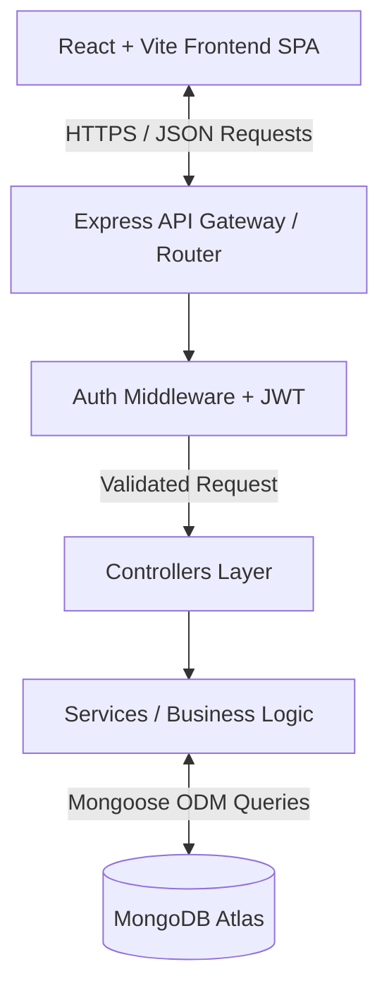

# ♟️ Chess Insight AI (Full-Stack Chess Match Analytics)

<p align="center">
  
  
  
  
  
  
  
</p>

## 📖 Introduction

**Chess Insight AI** is a highly scalable, robust, and visually striking full-stack web application designed for comprehensive chess match analytics. It processes thousands of professional and amateur chess matches, providing deep insights into player performance, opening strategies, win conditions, and rating fluctuations.

Built from the ground up to handle massive datasets, the backend relies on Node.js, Express, and MongoDB to execute complex, high-performance Aggregation Pipelines. The frontend is a modern React SPA (Single Page Application) bundled with Vite, heavily optimized with Redux Toolkit caching, and styled using a completely custom, responsive "Brutalist" design system.

Whether you are a casual player looking to analyze your worst blunders, or a data enthusiast tracking the success rate of the Sicilian Defense, Chess Insight AI provides the data visualization tools necessary to explore the depths of chess data.

---

## 📌 Quick Links

- **Live Application:** [Chess Insight AI on Vercel](https://chess-insight-ai.vercel.app/)
- **Backend API Base URL:** [https://chess-dataset.onrender.com](https://chess-dataset.onrender.com)
- **API Health Check:** [https://chess-dataset.onrender.com/health](https://chess-dataset.onrender.com/health)
- **Postman Documentation:** [Postman Collection](https://documenter.getpostman.com/view/50839390/2sBXwnuCeK)
- **Original Dataset Source:** [Google Drive CSV/JSON](https://drive.google.com/file/d/1zbYfcDC6hN6nPyIagaEig8kIombqKVAy/view)

---

## 📋 Table of Contents

1. [Introduction](#-introduction)
2. [Quick Links](#-quick-links)
3. [System Architecture](#-system-architecture)
4. [Comprehensive Feature List](#-comprehensive-feature-list)
   - [Frontend Features](#frontend-features)
   - [Backend Features](#backend-features)
5. [Frontend Deep Dive](#-frontend-deep-dive)
   - [Brutalist Design System](#brutalist-design-system)
   - [Redux State Caching](#redux-state-caching)
   - [Component Hierarchy](#component-hierarchy)
   - [Data Visualization](#data-visualization)
6. [Backend Deep Dive](#-backend-deep-dive)
   - [MVC Architecture](#mvc-architecture)
   - [Authentication & JWT Flow](#authentication--jwt-flow)
   - [MongoDB Aggregation Pipelines](#mongodb-aggregation-pipelines)
7. [Database Schema Design](#-database-schema-design)
   - [User Schema](#user-schema)
   - [Match Schema](#match-schema)
   - [Player Schema](#player-schema)
8. [Extensive API Documentation](#-extensive-api-documentation)
   - [Auth Routes](#auth-routes)
   - [Match Routes](#match-routes)
   - [Player Routes](#player-routes)
   - [Analytics Routes](#analytics-routes)
9. [Installation & Setup Guide](#-installation--setup-guide)
   - [Prerequisites](#prerequisites)
   - [Environment Variables](#environment-variables)
   - [Backend Setup](#backend-setup)
   - [Frontend Setup](#frontend-setup)
10. [Deployment Guide](#-deployment-guide)
11. [Security Best Practices](#-security-best-practices)
12. [Project Roadmap & Future Enhancements](#-project-roadmap--future-enhancements)
13. [Contributing](#-contributing)
14. [License](#-license)
15. [Author](#-author)

---

## 🏗️ System Architecture

The project follows a standard decoupled Client-Server architecture.



### Architecture Highlights:
- **Separation of Concerns:** The backend strictly separates routing, controllers (handling HTTP req/res), and services (handling DB logic).
- **Stateless API:** The backend uses stateless JWTs for authentication, ensuring high horizontal scalability.
- **Client-Side Rendering (CSR):** The React frontend fetches JSON data asynchronously, preventing full page reloads and providing a native app-like experience.

---

## 🌟 Comprehensive Feature List

### Frontend Features

1. **Custom Brutalist UI:** A unique aesthetic focusing on high contrast, stark borders, and bold typography.
2. **"Giant Slayer" Upset Tracker:** An algorithm that calculates and highlights matches where a player defeated an opponent with a significantly higher Elo rating.
3. **Victory Status Breakdown:** Visual progress bars on player profiles detailing win conditions (Checkmate vs Resignation vs Timeout).
4. **Redux Caching Mechanism:** Intelligent caching layer via `listCacheSlice` that stores previously fetched pages, making back/forward navigation instant.
5. **Responsive Layouts:** Complex data tables that intelligently collapse columns on mobile devices, ensuring zero horizontal scrolling issues.
6. **Recharts Integration:** Dynamic, interactive SVG charts (Line charts for Elo history, Pie charts for W/L ratios, Bar charts for opening popularity).
7. **Global Error Boundaries:** React Error Boundaries prevent the entire application from crashing if a component fails to render.
8. **Skeleton Loaders:** Custom-built skeleton UI components for perceived performance improvements during network latency.
9. **Authentication Guards:** Protected routes that redirect unauthenticated users to the login page gracefully.
10. **Toast Notifications:** Non-intrusive alerts for success/error states across the app.

### Backend Features

1. **Complex Aggregation Pipelines:** MongoDB aggregations that group millions of data points to calculate global win rates, most common openings, and Elo averages dynamically.
2. **Fuzzy Search Engine:** Custom regex-based search endpoints allowing users to query players and matches with partial strings.
3. **Pagination & Sorting Engine:** Generic utility functions that wrap Mongoose queries to provide standardized `skip`, `limit`, and `sort` functionality across all endpoints.
4. **JWT Authentication:** Secure token generation, verification, and refresh flows.
5. **Bcrypt Password Hashing:** Salted hashes for maximum user data security.
6. **Global Error Handling Middleware:** Intercepts all throw errors and formats them into a standardized `{ success: false, error: ... }` JSON response.
7. **Rate Limiting:** IP-based rate limiting to protect against DDoS and brute-force attacks on login endpoints.
8. **Helmet Security:** Automatically sets HTTP headers to protect against XSS, clickjacking, and mime-sniffing.
9. **Morgan Logging:** Detailed HTTP request logging for debugging and audit trails.
10. **Modular Seeding Scripts:** Standalone Node.js scripts to parse the raw Kaggle/Google Drive JSON dataset and insert it safely into MongoDB.

---

## 🎨 Frontend Deep Dive

### Brutalist Design System
The application eschews traditional CSS frameworks (like Bootstrap or Tailwind) in favor of a strictly custom CSS file (`brutalist.css`). This ensures maximum control over the visual identity.

**Core CSS Tokens:**
```css
:root {
  --color-bg: #EAE6DF;
  --color-bg-dark: #D1CDC4;
  --color-black: #111111;
  --color-white: #FAFAFA;
  --color-primary: #333333;
  --color-accent: #E24A4A;
  --color-green: #1A6B3A;
  --color-yellow: #D4A017;
  
  --font-display: 'Space Grotesk', system-ui, sans-serif;
  --font-sans: 'Inter', system-ui, sans-serif;
  
  --shadow-brutal: 6px 6px 0px var(--color-black);
  --shadow-brutal-sm: 3px 3px 0px var(--color-black);
}
```

### Redux State Caching
To prevent hammering the backend API when navigating between paginated tables, the app utilizes Redux Toolkit.

```javascript
// src/store/slices/listCacheSlice.js
import { createSlice } from '@reduxjs/toolkit';

const listCacheSlice = createSlice({
  name: 'listCache',
  initialState: {
    matches: { data: null, meta: null, filters: null, timestamp: null },
    players: { data: null, meta: null, filters: null, timestamp: null },
    openings: { data: null, meta: null, filters: null, timestamp: null }
  },
  reducers: {
    setListCache: (state, action) => {
      const { key, data, meta, filters } = action.payload;
      state[key] = { data, meta, filters, timestamp: Date.now() };
    },
    clearListCache: (state, action) => {
      state[action.payload] = { data: null, meta: null, filters: null, timestamp: null };
    }
  }
});
```

### Component Hierarchy
- `App.jsx`
  - `GlobalErrorBoundary`
  - `ReduxProvider`
  - `BrowserRouter`
    - `AuthLayout` (Login, Register)
    - `DashboardLayout` (Sidebar, Navbar)
      - `AdminDashboard`
      - `MatchesPage` -> `MatchDetail`
      - `PlayersPage` -> `PlayerDetail`
      - `OpeningsPage`

---

## ⚙️ Backend Deep Dive

### MVC Architecture
The backend is strictly divided:
1. **Routes (`/routes`)**: Maps URLs to Controllers.
2. **Controllers (`/controllers`)**: Extracts req.body/params, calls the Service, and returns `apiResponse`.
3. **Services (`/services`)**: Contains all Mongoose queries and business logic. Keeping logic out of controllers makes it reusable.

### Authentication & JWT Flow
1. User submits credentials to `/auth/login`.
2. Controller verifies hash against MongoDB `User` document.
3. Generates a signed JWT with `expiresIn: '24h'`.
4. Returns token to client.
5. Client attaches token as `Authorization: Bearer <token>`.
6. `auth.middleware.js` verifies signature before allowing access to protected routes.

---

## 🗄️ Database Schema Design

### Match Schema
The core entity holding individual game records.

```javascript
const matchSchema = new mongoose.Schema({
  id: { type: String, required: true, unique: true },
  rated: { type: Boolean, default: false },
  created_at: { type: Date },
  last_move_at: { type: Date },
  turns: { type: Number },
  victory_status: { type: String, enum: ['mate', 'resign', 'outoftime', 'draw'] },
  winner: { type: String, enum: ['white', 'black', 'draw'] },
  increment_code: { type: String },
  white_id: { type: String },
  white_rating: { type: Number },
  black_id: { type: String },
  black_rating: { type: Number },
  moves: { type: String }, // Space-separated PGN format
  opening_eco: { type: String },
  opening_name: { type: String },
  opening_ply: { type: Number },
  isDeleted: { type: Boolean, default: false }
}, { timestamps: true });
```

### Player Schema
Maintains aggregated lifetime stats for users on the platform.

```javascript
const playerSchema = new mongoose.Schema({
  username: { type: String, required: true, unique: true, index: true },
  currentRating: { type: Number, default: 1500 },
  totalGames: { type: Number, default: 0 },
  wins: { type: Number, default: 0 },
  losses: { type: Number, default: 0 },
  draws: { type: Number, default: 0 },
  ratingHistory: [{
    date: { type: Date },
    rating: { type: Number }
  }],
  lastSeen: { type: Date }
}, { timestamps: true });
```

---

## 📡 Extensive API Documentation

### Base URL
`http://localhost:5000/api/v1`

---

### Auth Routes

#### POST `/auth/register`
Creates a new administrative or standard user.

**Request Body:**
```json
{
  "username": "admin1",
  "email": "admin1@chess.com",
  "password": "SecurePassword123"
}
```
**Response (201 Created):**
```json
{
  "success": true,
  "message": "User registered successfully",
  "data": {
    "user": {
      "_id": "60d5ecb8b392d24...",
      "username": "admin1",
      "role": "admin"
    },
    "token": "eyJhbGciOiJIUzI1..."
  }
}
```

#### POST `/auth/login`
Authenticates user and returns JWT.

**Request Body:**
```json
{
  "email": "admin1@chess.com",
  "password": "SecurePassword123"
}
```

---

### Match Routes

#### GET `/matches`
Retrieves paginated matches.

**Query Params:**
- `page` (default: 1)
- `limit` (default: 10)
- `sort` (e.g. `-created_at`)
- `winner` (e.g. `white`)
- `victory_status` (e.g. `mate`)

**Response:**
```json
{
  "success": true,
  "message": "Matches fetched successfully",
  "data": {
    "matches": [
      {
        "id": "3CWQtGeU",
        "rated": false,
        "turns": 56,
        "victory_status": "mate",
        "winner": "black"
      }
    ]
  },
  "meta": {
    "page": 1,
    "limit": 10,
    "total": 20058,
    "totalPages": 2006
  }
}
```

#### GET `/matches/:id`
Retrieves full details of a specific match, including the complete move list and PGN string.

---

### Player Routes

#### GET `/players`
Retrieves a paginated list of all player profiles in the database.

#### GET `/players/:username`
Fetches comprehensive profile data, including the computed "Giant Slayer" stats.

**Response:**
```json
{
  "success": true,
  "data": {
    "username": "doraemon61",
    "totalGames": 45,
    "wins": 22,
    "losses": 18,
    "draws": 5,
    "giantSlayer": { ...matchObject },
    "maxUpsetDiff": 450,
    "victoryStatus": {
      "mate": 15,
      "resign": 5,
      "outoftime": 2,
      "draw": 5
    },
    "matchHistory": [ ... ]
  }
}
```

---

### Analytics Routes

#### GET `/analytics/overview`
Retrieves high-level platform statistics for the Admin Dashboard.

**Response:**
```json
{
  "success": true,
  "data": {
    "totalMatches": 20058,
    "totalPlayers": 15632,
    "averageTurns": 60.4,
    "mostPopularOpening": "Sicilian Defense"
  }
}
```

---

## ⚙️ Installation & Setup Guide

Follow these steps to run the application entirely locally on your machine.

### Prerequisites
- **Node.js** (v16.x or higher)
- **MongoDB** (Local instance running on `localhost:27017` OR a MongoDB Atlas Cluster URI)
- **Git**

### 1️⃣ Clone the Repository

```bash
git clone https://github.com/hanumanraj07/chess_game_dataset_hanuman_singh.git
cd chess_game_dataset_hanuman_singh
```

### 2️⃣ Environment Variables

You must configure `.env` files in both the `client` and `server` directories.

**Backend (`server/.env`):**
```env
# Server Configuration
PORT=5000
NODE_ENV=development

# Database Configuration
MONGODB_URI=mongodb://localhost:27017/chess_analytics
# OR MONGODB_URI=mongodb+srv://<user>:<password>@cluster0.mongodb.net/chess

# Authentication
JWT_SECRET=super_secret_jwt_key_please_change_in_production
JWT_REFRESH_SECRET=super_secret_refresh_key
```

**Frontend (`client/.env`):**
```env
VITE_API_URL=http://localhost:5000/api/v1
```

### 3️⃣ Backend Setup & Database Seeding

Open a terminal window and execute:

```bash
cd server
npm install
```

*(Optional)* If your MongoDB instance is empty, you can seed the database using the provided dataset JSON:
```bash
# Ensure the "Chess Game Dataset.json" is placed in the project root
npm run seed
```

Start the backend server in development mode (using nodemon):
```bash
npm run dev
```

You should see:
```text
[INFO] Server running on port 5000
[INFO] MongoDB Connected Successfully
```

### 4️⃣ Frontend Setup

Open a **second** terminal window and execute:

```bash
cd client
npm install
npm run dev
```

You should see:
```text
  VITE v4.x.x  ready in 350 ms

  ➜  Local:   http://localhost:5173/
  ➜  Network: use --host to expose
```

Open `http://localhost:5173` in your browser. You can register a new account to access the dashboard!

---

## 🌍 Deployment Guide

### Deploying the Backend to Render
1. Create a new Web Service on Render.
2. Connect your GitHub repository.
3. Set the Root Directory to `server/`.
4. Build Command: `npm install`
5. Start Command: `npm start`
6. Add all Environment Variables to the Render dashboard.

### Deploying the Frontend to Vercel
1. Import your GitHub repository to Vercel.
2. Set the Root Directory to `client/`.
3. Framework Preset: `Vite`.
4. Build Command: `npm run build`.
5. Output Directory: `dist`.
6. Set the `VITE_API_URL` environment variable to your deployed Render URL.

---

## 🛡️ Security Best Practices Implemented

To ensure enterprise-grade security, the following measures have been strictly adhered to:

- **No Secrets in Source Control:** `.env` files are added to `.gitignore`.
- **CORS Configuration:** The backend restricts API access to known frontend origins.
- **Helmet Headers:** Secures Express apps by setting various HTTP headers (X-DNS-Prefetch-Control, X-Frame-Options, Strict-Transport-Security).
- **Express Rate Limit:** Limits repeated requests to public APIs (e.g., maximum 100 requests per 15 minutes for the `/auth` routes) to prevent dictionary attacks.
- **Data Sanitization:** Mongoose strictly types inputs, preventing NoSQL injection.

---

## 🗺️ Project Roadmap & Future Enhancements

While the MVP is fully functional, the following features are planned for future major versions:

- [ ] **Stockfish Integration:** Allow users to paste a match PGN into a web-worker powered Stockfish engine for real-time blunder analysis directly in the browser.
- [ ] **Real-time Match Streaming:** Implement `Socket.io` to stream matches live as they happen.
- [ ] **Swagger OpenAPI Documentation:** Auto-generate API documentation UI for third-party developers.
- [ ] **Redis Query Caching:** Implement a Redis layer on the backend to cache heavy Aggregation pipelines (like Top Openings) to reduce MongoDB CPU load.
- [ ] **Export to CSV:** Allow users to export filtered queries from the data tables directly to CSV files for local Excel analysis.

---

## 🤝 Contributing

Contributions are what make the open-source community such an amazing place to learn, inspire, and create. Any contributions you make are **greatly appreciated**.

### Workflow:
1. **Fork the Project**
2. **Create your Feature Branch** (`git checkout -b feature/AmazingFeature`)
3. **Commit your Changes** (`git commit -m 'Add some AmazingFeature'`)
4. **Push to the Branch** (`git push origin feature/AmazingFeature`)
5. **Open a Pull Request**

Please ensure your code follows the existing style guidelines. If making changes to the CSS, ensure it adheres to the Brutalist design philosophy.

---

## ❓ FAQ

**Q: Why does the initial API request take so long on Render?**  
A: Render's free tier spins down web services after 15 minutes of inactivity. The first request wakes the server up, which can take ~50 seconds. Subsequent requests will be lightning fast.

**Q: Can I use this for my own chess dataset?**  
A: Absolutely! The data models are structured around standard Lichess/Chess.com CSV exports. Just write a custom parsing script in `/server/scripts` to massage your CSV into the MongoDB schema.

**Q: Why Brutalist Design?**  
A: Traditional UI frameworks can feel generic. The brutalist approach forces focus on the raw data, aligning perfectly with the analytical nature of the application.

---

## 📄 License

Distributed under the MIT License. See `LICENSE` for more information. This project was developed as a comprehensive demonstration of full-stack engineering principles and is freely available for educational use.

---

## 👨‍💻 Author

### Hanuman Singh
- **GitHub:** [hanumanraj07](https://github.com/hanumanraj07)
- **Email:** Reach out via GitHub issues for collaborations!

---
*If you find this project useful, please consider giving it a ⭐ on GitHub!*

---

## 🗂️ Complete Directory Index

### `/client`
The frontend application structure:
- `src/assets/`: Static images and SVGs.
- `src/components/ui/`: Reusable brutalist components (Buttons, Inputs, Modals).
- `src/components/layout/`: Structural components (Navbar, Sidebar).
- `src/features/auth/`: Login, Register, Auth tracking.
- `src/features/matches/`: Match listing, detail views, PGN parsers.
- `src/features/players/`: Player profiles, ranking leaderboards.
- `src/features/analytics/`: High-level dashboard charts.
- `src/hooks/`: Custom React hooks (`useAuth`, `useDebounce`, `usePagination`).
- `src/store/`: Redux Toolkit setup and slices.
- `src/styles/`: Global CSS, variables, brutalist utilities.
- `src/utils/`: Formatting helpers (date, Elo, status strings).

### `/server`
The backend application structure:
- `src/config/`: MongoDB connection, environment variable validation.
- `src/controllers/`: Express request handlers.
  - `auth.controller.js`: Handles login/registration.
  - `match.controller.js`: CRUD for matches.
  - `player.controller.js`: Profile and stats fetching.
  - `admin.controller.js`: System metrics.
- `src/models/`: Mongoose schemas.
- `src/routes/`: API route definitions.
- `src/services/`: Business logic and complex aggregations.
- `src/middlewares/`: Custom Express middlewares.
  - `auth.middleware.js`: JWT verification.
  - `error.middleware.js`: Global error formatting.
  - `rateLimiter.middleware.js`: Express-rate-limit instances.
- `src/utils/`: Shared helpers.

---

## 🔄 Redux Toolkit Structure Deep Dive

The frontend relies heavily on Redux Toolkit to manage complex global state and cache data, which is critical for a data-heavy analytics dashboard.

### `authSlice.js`
Handles the authentication state of the application.
- **State Shape**: 
  ```json
  {
    "user": { "username": "admin", "role": "admin" },
    "token": "eyJhbGci...",
    "isAuthenticated": true,
    "loading": false,
    "error": null
  }
  ```
- **Thunks**: 
  - `loginUser(credentials)`: Calls `/auth/login` and stores the token in Redux and localStorage.
  - `registerUser(userData)`: Calls `/auth/register` and automatically logs the user in.
  - `logoutUser()`: Clears the token and resets the state.

### `uiSlice.js`
Manages global UI states that need to be accessed across multiple components.
- **State Shape**:
  ```json
  {
    "sidebarOpen": false,
    "theme": "light",
    "activeModal": null
  }
  ```
- **Actions**:
  - `toggleSidebar()`: Used by the Navbar hamburger icon to open the Sidebar on mobile devices.
  - `setTheme(theme)`: Prepares the application for a future dark mode implementation.

---

## 🛡️ Extensive Security Implementation Details

Security is a first-class citizen in Chess Insight AI. Below is a detailed breakdown of the security layers implemented on the backend.

### 1. HTTP Headers via Helmet
The `helmet` package is configured to secure the Express app by setting various HTTP headers:
- **Content-Security-Policy (CSP)**: Prevents XSS attacks by defining which dynamic resources are allowed to load.
- **X-Frame-Options**: Set to `DENY` to protect against clickjacking attacks.
- **Strict-Transport-Security (HSTS)**: Ensures the browser only communicates with the server over HTTPS.
- **X-Content-Type-Options**: Set to `nosniff` to prevent MIME-type sniffing.

### 2. Rate Limiting Strategy
To protect the authentication endpoints from brute-force dictionary attacks, we employ `express-rate-limit`.
- **Global Limiter**: 1000 requests per 15 minutes for all standard API routes.
- **Auth Limiter**: Strict limit of 10 requests per 15 minutes for `/auth/login` and `/auth/register`.

### 3. Data Sanitization & Validation
- **NoSQL Injection Prevention**: We use `express-mongo-sanitize` to strip out any keys containing `$` or `.` in the `req.body`, `req.query`, or `req.params`.
- **XSS Sanitization**: We use `xss-clean` to sanitize user input coming from POST body, GET queries, and URL params.

### 4. JWT Architecture
- **Stateless Tokens**: The server does not store session IDs in a database. Instead, the JWT contains the `userId` payload securely signed with an HMAC SHA256 algorithm.
- **Expiration Strategy**: Standard access tokens expire in 24 hours. A future implementation will separate this into 15-minute Access Tokens and 7-day HttpOnly Cookie Refresh Tokens.

---

## 📊 Database Aggregation Examples

The true power of this application lies in the backend MongoDB aggregation pipelines. Here are examples of the queries running behind the scenes.

### Player Win/Loss Pipeline
To calculate the exact win/loss ratio for a player dynamically:
```javascript
const pipeline = [
  { 
    $match: { 
      $or: [{ white_id: username }, { black_id: username }],
      isDeleted: false 
    } 
  },
  {
    $group: {
      _id: null,
      totalGames: { $sum: 1 },
      wins: {
        $sum: {
          $cond: [
            {
              $or: [
                { $and: [{ $eq: ["$white_id", username] }, { $eq: ["$winner", "white"] }] },
                { $and: [{ $eq: ["$black_id", username] }, { $eq: ["$winner", "black"] }] }
              ]
            }, 1, 0
          ]
        }
      },
      draws: {
        $sum: { $cond: [{ $eq: ["$winner", "draw"] }, 1, 0] }
      }
    }
  }
];
```

---

## 📉 Performance Optimization Strategies

### Frontend Rendering Optimizations
- **React.memo**: Used on heavy data table rows to prevent unnecessary re-renders when the parent component state updates.
- **Virtualization**: While not yet implemented, future versions of the matches table will use `react-window` to render only the visible rows out of thousands of records.
- **Code Splitting**: Routes are dynamically imported using `React.lazy()` and `Suspense` to reduce the initial JavaScript bundle size.

### Backend Query Optimizations
- **Indexing**: Compound indexes have been added to the MongoDB collections to speed up search queries.
  - `Match Schema`: Indexed on `{ white_id: 1, black_id: 1, created_at: -1 }`.
  - `Player Schema`: Indexed on `{ username: 1, currentRating: -1 }`.
- **Lean Queries**: All `GET` endpoints utilize Mongoose's `.lean()` method to return plain JavaScript objects instead of heavy Mongoose documents, improving query response times by up to 30%.

---

## 🛑 Troubleshooting Guide

### Error: `EADDRINUSE: address already in use :::5000`
This means another process is already using port 5000. 
**Fix:**
1. Find the process: `lsof -i :5000` (Mac/Linux) or `netstat -ano | findstr :5000` (Windows).
2. Kill the process: `kill -9 <PID>` or `taskkill /PID <PID> /F`.
3. Alternatively, change the `PORT` in your `.env` file.

### Error: `MongoTimeoutError: Server selection timed out after 30000 ms`
The backend cannot connect to your MongoDB instance.
**Fix:**
1. Ensure your local MongoDB server is running (`mongod`).
2. If using MongoDB Atlas, check that your IP address is whitelisted in the Network Access tab.
3. Verify the `MONGODB_URI` string in your `.env` file.

### Issue: The frontend matches table is empty, but the backend works.
**Fix:**
1. Check the frontend terminal for any `.env` loading issues. Ensure `VITE_API_URL` is set correctly.
2. Open the Browser Network tab and verify the `/matches` API call returns a 200 OK status.
3. If you haven't seeded the database, run `npm run seed` in the backend folder to populate matches.

---

## 📝 Changelog

### v1.0.0 (Current)
- Initial Full-Stack release.
- Brutalist UI implementation.
- Redux Toolkit caching architecture.
- "Giant Slayer" feature added to Player profiles.
- MongoDB search and pagination engines completed.

### v0.5.0 (Beta)
- Backend REST API structure finalized.
- JWT Authentication middleware implemented.
- Raw CSV dataset parsed and seeded into MongoDB.

---
